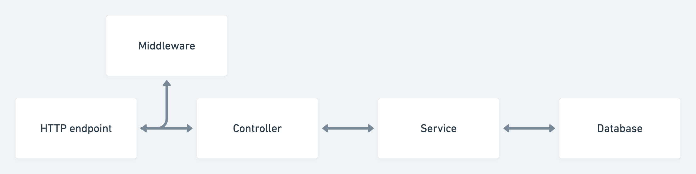

# a simple api for appointment booking

## project directory

```bash
[src
 ┣ config
 ┃ ┣ default.ts
 ┃ ┗ test.ts
 ┣ db
 ┃ ┣ migrations
 ┃ ┃ ┗ 20240119094003_create_appointments_tables.js
 ┃ ┣ seeds
 ┃ ┃ ┣ 01_user.js
 ┃ ┃ ┣ 02_providers.js
 ┃ ┃ ┗ 03_appointments.js
 ┃ ┗ knex.ts
 ┣ diagrams
 ┃ ┗ data-flow.png
 ┣ middleware
 ┃ ┣ authenticate.ts
 ┃ ┣ errorHandler.ts
 ┃ ┣ openApiValidatorError.ts
 ┃ ┣ requireUser.ts
 ┃ ┗ validate.ts
 ┣ module
 ┃ ┗ setupRoutes.ts
 ┣ routes
 ┃ ┣ appointment.routes.ts
 ┃ ┣ auth.routes.ts
 ┃ ┣ index.ts
 ┃ ┗ providers.routes.ts
 ┣ schema
 ┃ ┣ appointment.ts
 ┃ ┣ error.ts
 ┃ ┣ provider.ts
 ┃ ┣ response.ts
 ┃ ┗ spec.ts
 ┣ services
 ┃ ┣ appointment.service.ts
 ┃ ┣ auth.service.ts
 ┃ ┗ providers.service.ts
 ┣ utils
 ┃ ┣ connection.ts
 ┃ ┣ error.ts
 ┃ ┣ jwt.util.ts
 ┃ ┣ logger.ts
 ┃ ┣ responseBuilder.ts
 ┃ ┣ sanitizeduser.ts
 ┃ ┗ uploadphoto.ts
 ┣ __tests__
 ┣ app.ts
 ┗ server.ts](src/diagrams)
```

## Installation

``
pnpm install
``

## Running the app

``
pnpm dev
``

## migration

``
pnpm migration
``

## migrate:rollback

``
pnpm migrate:rollback
``

## migration latest

``
pnpm migration:latest
``

## seed

``
pnpm seed
``

## seed run

``
pnpm seed:run
``

## API local documention

http://localhost:1487/api/docs/#/

## Live demo
https://appointment-api-1uq8.onrender.com

see docs for endpoints.


http://localhost:1487/api/docs/#/

## API web documention
https://appointment-api-1uq8.onrender.com/api/docs/#/

## Design flow


